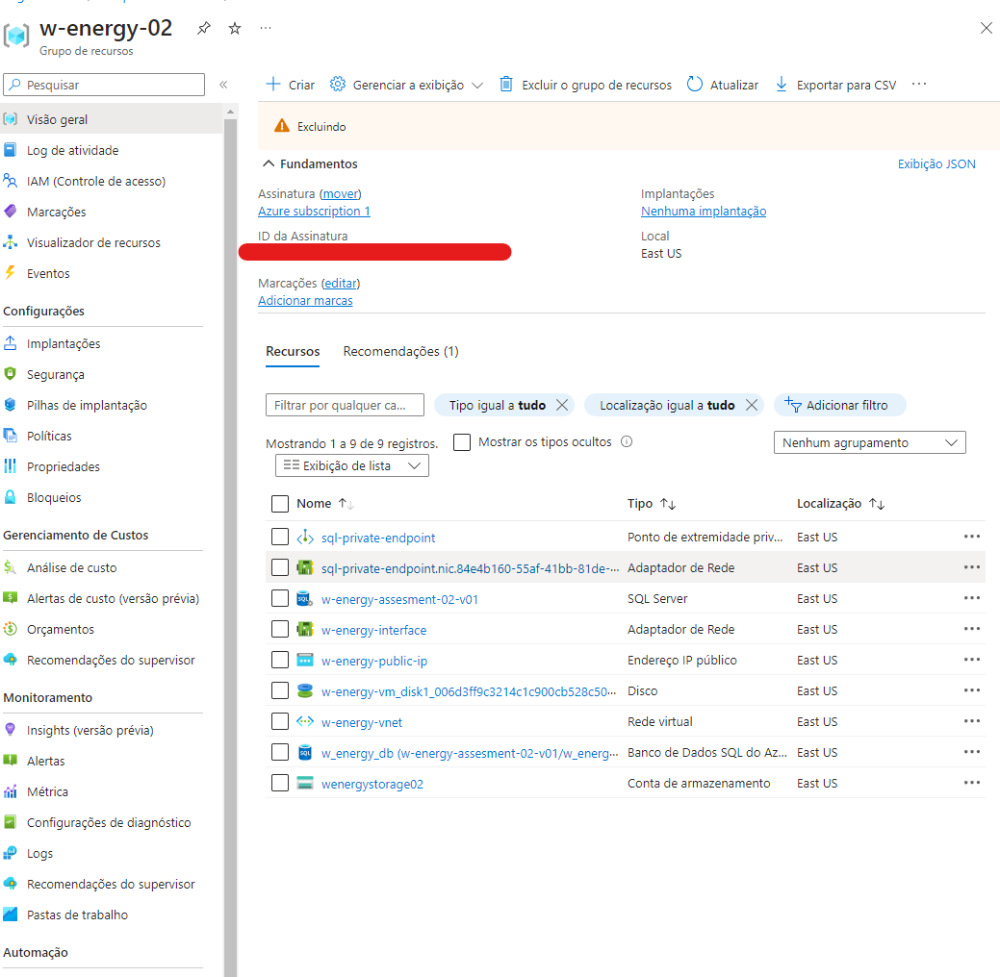
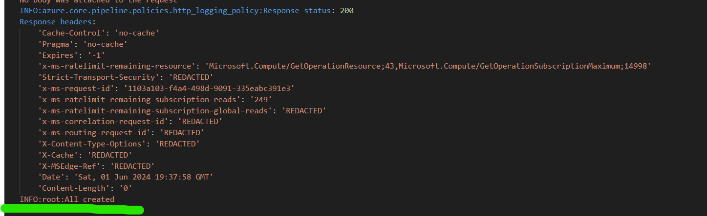

# W-Energy-02

## Prerequisites

- **python3**
- **pip**
- **Linux/Windos+WSL**
- **Azure subscription**
- **Azure credentials** (Client ID, Client Secret, Tenant ID)

## Setup

1. Install the required packages:

```sh
  ./setup_environment.sh
```

2. Create you env file using [.env.example](./automation/azure/.env.example)

## How To Use

The script was created to receive params, so you can pass params as needed

Example:

```sh
python3 ./azure_resources.py --create-all
```

And All resources would be created

As requested, you can stop, start, delete and recreate VM with the following parameters

```sh
python3 ./azure_resources.py --stop-vm
python3 ./azure_resources.py --start-vm
python3 ./azure_resources.py --delete-vm
python3 ./azure_resources.py --create-vm
```

## Resources and Logs





## Errors

To avoid problems when a retry occur, before create a new resource the script verify if it already created and ignore it. thats avoid to create duplicated resources too.
